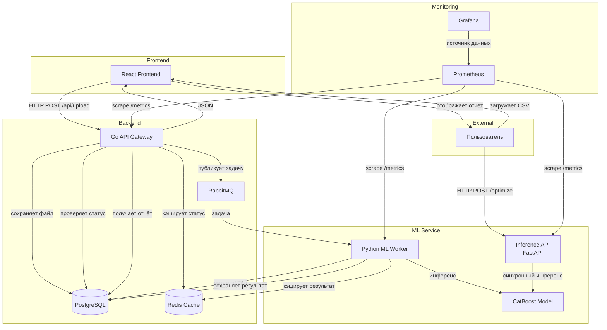

# Сервис динамического ценообразования
Сервис позволяет загружать исторические транзакции (CSV) и получать рекомендации по оптимальным ценам для максимизации валовой прибыли.
## Возможности
- Автоматическая предобработка и генерация признаков
- Прогноз спроса с помощью CatBoost на CPU/GPU
- Подбор оптимальной цены 
- Асинхронная обработка через RabbitMQ
- Веб-интерфейс на React + TypeScript
- Мониторинг Prometheus + Grafana
## Требования
- Docker 20.10+
- Docker Compose 2.0+
- 8+ ГБ свободной RAM (для GPU-ускорения требуется NVIDIA Docker)
## Установка и запуск
1. Склонируйте репозиторий.
2. Поместите обученную модель `catboost_model_tuned.cbm` в папку `models/`.
3. Выполните в корне проекта:
 ```bash
 docker-compose up --build
 ```
 ## Использование

Откройте в браузере http://localhost

### Через веб-интерфейс
1. Нажмите **«Выберите файл»** и загрузите CSV с транзакциями.  
   Формат файла:  
   `OrderKey,OrderDate,ProductKey,Quantity,UnitPrice,UnitCost,CurrencyCode,ExchangeRate`
2. Нажмите **«Загрузить и оптимизировать»**.
3. Дождитесь статуса `completed` – отобразится таблица с оптимальными ценами и ожидаемой прибылью.

### Через API Gateway (асинхронно)
```bash
curl -X POST http://localhost:8080/upload -F "file=@sample.csv"
# Вернёт task_id
curl http://localhost:8080/task/{task_id}
```
### Через Inference API (синхронно)
```bash
curl -X POST http://localhost:8000/optimize -F "file=@sample.csv"
```
## Мониторинг
- **Prometheus:** http://localhost:9090
- **Grafana:** http://localhost:3000 (admin/admin)  
  Дашборд **«Dynamic Pricing Worker Monitoring»** показывает метрики обработки задач.

## Архитектура



Подробная документация по лабораторным работам находится в папке `docs/`.

---