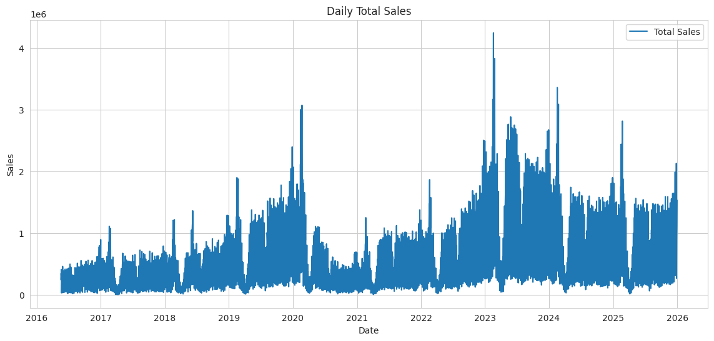
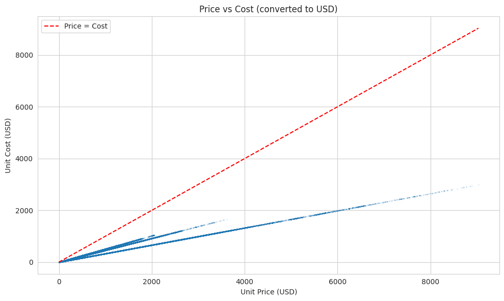
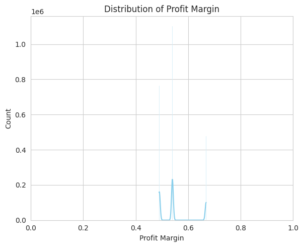
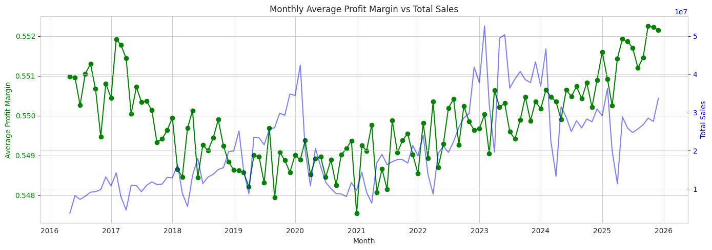
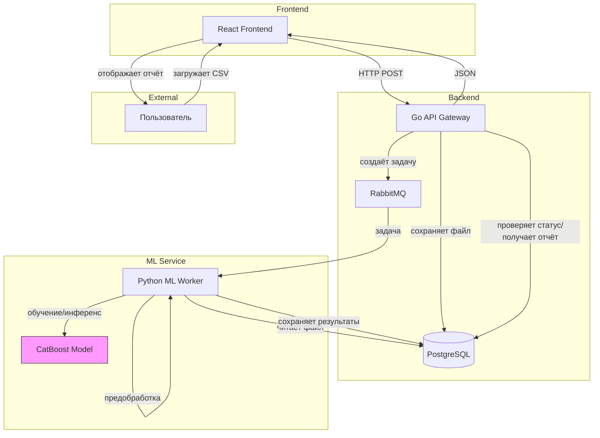
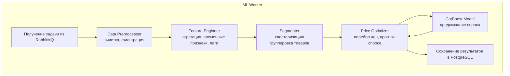

# Сервис динамического ценообразования

## Шаг 1. Выбор темы

**Выбранная тема:** Сервис динамического ценообразования

## Шаг 2. Формулировка бизнес-задачи и её ML-интерпретация

### 1) Какую проблему решает сервис?

Сервис решает проблему неоптимального ценообразования в e‑commerce. Товары часто продаются по ценам, которые либо занижены (упущенная выгода), либо завышены (снижение спроса, залеживание товаров). Отсутствие автоматизированного инструмента приводит к потере прибыли и росту издержек на хранение.

### 2) Какую выгоду он несет, и кто её получит?

-   **Выгода:** Увеличение валовой прибыли, повышение оборачиваемости товарных запасов, снижение трудозатрат на мониторинг и анализ рынка.
    
-   **Бенефициары:**
    
    -   Компания (владелец бизнеса) – рост финансовых показателей.
    -   Менеджеры – получают инструмент для обоснованного принятия решений.

### 3) Зачем тут ML? Какая его функция?

ML используется для прогнозирования спроса в зависимости от цены. На основе этого прогноза оптимизатор подбирает цену, максимизирующую ожидаемую прибыль. Без ML невозможно учесть сложные нелинейные зависимости и адаптироваться к динамике рынка.

### 4) Какие входные и выходные данные предполагаются?

**Входные данные (загружаются пользователем в CSV):**

-   Исторические транзакции: `InvoiceNo`, `StockCode`, `Description`, `Quantity`, `UnitPrice`, `InvoiceDate`, `CustomerID`, `Country`.
    

**Выходные данные (результат работы сервиса):**

-   Рекомендуемая цена для каждого товара (или для каждого товарного сегмента).
-   Ожидаемый спрос при этой цене.
-   Ожидаемое увеличение прибыли по сравнению с текущей ценой.
-   Визуализации (график зависимости прибыли от цены, временные ряды).

## Шаг 3. Определение метрик качества

### Бизнес-метрики

1.  **Валовая прибыль (Gross Profit):**  
    `(Цена продажи – Себестоимость) * Количество продаж`.  
    Основная цель – максимизировать этот показатель на тестируемой группе товаров.
    
2.  **Оборачиваемость запасов (Inventory Turnover):**  
    Количество проданных единиц товара за период. Хорошая оборачиваемость снижает издержки на хранение.
    
3.  **Выручка (Revenue):**  
    Дополнительная метрика, позволяющая оценить масштаб влияния на бизнес.
    

**Как качество модели влияет на бизнес:**  
Ошибка в прогнозе спроса (например, завышение) может привести к установке слишком высокой цены, что снизит продажи и прибыль. Заниженная цена даст быстрые продажи, но упустит потенциальную прибыль. Точность модели напрямую влияет на реализацию бизнес-метрик.

### ML-метрики

1.  **MAE (Mean Absolute Error)** – средняя абсолютная ошибка прогноза спроса.  
    _Почему выбрана:_ Простота интерпретации: показывает, на сколько единиц в среднем модель ошибается в предсказании количества продаж.  
    _Связь с бизнесом:_ Ошибка в 1 единицу для низкомаржинального товара может быть критична, для высокомаржинального – менее важна. Но в целом MAE даёт понимание стабильности модели.
    
2.  **RMSE (Root Mean Squared Error)** – квадратный корень из среднеквадратичной ошибки.  
    _Почему выбрана:_ Сильнее штрафует большие выбросы, что важно для товаров с высокими пиками спроса.  
    _Связь с бизнесом:_ Большие ошибки могут привести к сильному отклонению рекомендуемой цены и значительным потерям прибыли.

## Шаг 4. Источник данных и EDA

### 4.1 Источник данных
Для проекта выбран датасет **Contoso Sales**, представляющий реальные транзакционные данные крупного ритейлера. Датасет предоставлен Microsoft в рамках учебных материалов по бизнес-аналитике. Основные характеристики:
- **Объём:** 2 349 091 запись.
- **Период:** май 2016 – декабрь 2025 (≈10 лет).
- **Ключевые поля:**
	 - `OrderKey` – уникальный идентификатор заказа (связка с деталями).
	 - `LineNumber` – номер позиции в заказе.
	 - `OrderDate` – дата оформления заказа.
	 - `DeliveryDate` – дата доставки.
	 - `CustomerKey` – идентификатор клиента.
	 - `StoreKey` – идентификатор магазина (или канала продаж).
	 - `ProductKey` – идентификатор товара.
	 - `Quantity` – количество единиц товара в позиции заказа.
	 - `UnitPrice` – цена за единицу товара (до вычета скидок).
	 - `NetPrice` – цена после применения скидок (в валюте заказа).
	 - `UnitCost` – себестоимость единицы товара.
	 - `CurrencyCode` – валюта сделки (USD, EUR, GBP, CAD, AUD).
	 - `ExchangeRate` – курс к базовой валюте (USD).
- **Преимущества:** наличие `UnitCost` позволяет точно рассчитывать валовую прибыль; отсутствуют пропуски; длинный временной ряд; есть категориальные признаки `ProductKey``.

### 4.2 Разведочный анализ данных (EDA)

#### 4.2.1 Первичный обзор
- Размер данных: 2 349 091 строк, 13 столбцов.
- Пропуски: отсутствуют во всех столбцах.
- Типы данных: числовые (int, float), даты, категориальные строки (`CurrencyCode`).
- Диапазон дат: май 2016 – декабрь 2025.

#### 4.2.2 Очистка и подготовка
- Удалены строки с `Quantity <= 0`, `UnitPrice <= 0`, `UnitCost <= 0` – такие записи отсутствуют, данные изначально чисты.
- Для унификации валют все цены пересчитаны в USD с использованием поля `ExchangeRate`. 
	- `UnitPrice_USD = UnitPrice / ExchangeRate` (если `CurrencyCode` не USD). 
	- `UnitCost_USD = UnitCost / ExchangeRate`.
- Созданы признаки:
	 - `TotalSales = Quantity * UnitPrice_USD` – выручка по позиции в USD.
	 - `TotalCost = Quantity * UnitCost_USD` – себестоимость проданных товаров в USD.
	 - `TotalProfit = TotalSales - TotalCost` – валовая прибыль в USD.
	 - `ProfitMargin = (UnitPrice_USD - UnitCost_USD) / UnitPrice_USD` – маржинальность (от 0 до 1).

#### 4.2.3 Визуализация и анализ

**Временной охват**  
  
*Данные равномерно распределены по датам, что позволяет анализировать долгосрочные тренды.*

**Цена vs себестоимость**  
  
*Наличие обеих величин позволяет точно рассчитывать прибыль.*

**Распределение маржинальности**  
  
*Маржинальность варьируется от 0 до 0.7, что оправдывает индивидуальный подход к ценообразованию.*

**Динамика маржинальности и продаж**  
  

#### 4.2.4 Агрегация данных для ML-модели
Для построения модели предсказания спроса данные агрегированы до уровня «товар-день»:
- Группировка по `ProductKey` и `DateOnly`.
- Признаки: `total_quantity`, `avg_price`, `avg_unit_cost`, `total_sales`, `total_profit`, `transactions`.
- Итоговый датафрейм: **1 609 515** строк.

### 4.3 Выводы
- Датасет соответствует требованиям: содержит цену, себестоимость, количество и временные метки.
- Длинный временной диапазон позволяют строить надёжные модели.
- Наличие категориальных признаков даёт возможность использовать CatBoost с учётом индивидуальных особенностей товаров.
- Визуализации подтверждают реалистичность данных и необходимость динамического ценообразования.

## Шаг 5. Проектирование высокоуровневой архитектуры системы

### 5.1. Контекстная диаграмма

### 5.2. Основные потоки данных

**5.2.1 Взаимодействие пользователя:**

1.  Пользователь через веб-интерфейс загружает CSV-файл с историческими продажами.
2.  Фронтенд отправляет файл в Go API Gateway (REST).
3.  API создаёт задачу, сохраняет файл и публикует сообщение в RabbitMQ.
4.  Пользователь получает `task_id` и может отслеживать статус.
5.  По готовности отчёта пользователь скачивает результаты через тот же интерфейс.

**5.2.2 Откуда поступают данные для обучения / инференса:**

-   **Обучение модели:** Данные для обучения берутся из загруженного пользователем CSV (если модель обучается на его данных) или из предварительно обученной универсальной модели.
-   **Инференс:** Для каждого товара используется его исторический контекст (лаги, скользящие средние), извлекаемый из того же CSV после предобработки.

**5.2.3 Куда сохраняются результаты:**  
Результаты оптимизации (рекомендуемые цены, ожидаемая прибыль) сохраняются в PostgreSQL в таблицу `recommendations`, связанную с `task_id`. Также могут сохраняться промежуточные файлы (например, очищенные данные) в объектном хранилище.

## Шаг 6. Выделение модулей и протоколов взаимодействия

 ### 6.1 Модули и их ответственность

1.  **Модуль пользовательского интерфейса (Frontend)**  
    _Ответственность:_ Обеспечивает взаимодействие с пользователем: загрузка CSV-файла с историческими продажами, отображение статуса обработки задачи, визуализация результатов оптимизации в виде таблиц и графиков.  
    _Протоколы взаимодействия:_ Общается с API Gateway по протоколу HTTPS (REST). Использует JSON для передачи данных.
    
2.  **Модуль API Gateway (Backend на Go)**  
    _Ответственность:_ Принимает HTTP-запросы от фронтенда, сохраняет загруженный файл, регистрирует задачу в базе данных, публикует сообщение в очередь, предоставляет эндпоинты для проверки статуса задачи и получения готового отчёта.  
    _Протоколы взаимодействия:_ REST API (HTTPS) для общения с фронтендом; AMQP (через RabbitMQ) для отправки задач в очередь; SQL для записи метаданных и результатов в PostgreSQL.
    
3.  **Модуль очереди сообщений (RabbitMQ)**  
    _Ответственность:_ Обеспечивает асинхронную передачу задач между API Gateway и ML-воркером, гарантирует надёжную доставку, позволяет масштабировать воркеры.  
    _Протоколы взаимодействия:_ AMQP 0-9-1.
    
4.  **Модуль хранения данных (PostgreSQL)**  
    _Ответственность:_ Хранит информацию о задачах (статус, путь к файлу), результаты оптимизации (рекомендуемые цены, прибыль), а также пользовательские данные.  
    _Протоколы взаимодействия:_ SQL (через драйверы для Go и Python).
    
5.  **Модуль ML-воркера (Python)**  
    Состоит из подмодулей:
    
    -   **Data Preprocessor:** очистка данных (удаление возвратов, нулевых цен), приведение типов.
    -   **Feature Engineer:** создание временных признаков (год, месяц, день недели), лагов спроса и цены, скользящих средних, конвертация валют в USD.
    -   **Segmenter (опционально):** группировка товаров по поведенческим паттернам или категориям для обучения отдельных моделей.
    -   **Price Optimizer:** перебор цен в заданном диапазоне, вызов модели для прогноза спроса, вычисление прибыли, выбор цены с максимальной ожидаемой прибылью.
    -   **CatBoost Model:** предсказание спроса на основе признаков (включая категориальные `ProductKey`, `StoreKey` и др.).
    -   **Сохранение результатов:** запись оптимальных цен в PostgreSQL.
        
    _Протоколы взаимодействия:_ Внутри воркера модули общаются через вызовы функций. С базой данных – SQL, с очередью – AMQP. Модель загружается из файла (`.cbm`) при старте воркера.

### 6.2 Диаграмма модулей ML-воркера

1.  **Пользователь** загружает CSV-файл с историческими продажами через **React Frontend**.
2.  Фронтенд отправляет файл по **HTTP POST** в **Go API Gateway**.
3.  **Go API** сохраняет файл и регистрирует задачу в **PostgreSQL** со статусом `pending`.
4.  **Go API** публикует сообщение с `task_id` и путём к файлу в очередь **RabbitMQ**.
5.  **Python ML Worker**, подписанный на очередь, забирает задачу.
6.  **Worker** выполняет последовательные шаги:
    -   **Очистка данных** (удаление возвратов, нулевых цен, дубликатов).
    -   **Генерация признаков** (TotalPrice, временные признаки, лаги, скользящие средние).
    -   **Сегментация товаров** (по категориям, RFM-анализу или кластеризации).
    -   Для каждого сегмента (или для каждого товара) **оптимизатор** подбирает цену, максимизирующую прибыль, используя **CatBoost модель** для прогноза спроса.
7.  Результаты (рекомендуемые цены, ожидаемая прибыль, улучшение) сохраняются в **PostgreSQL**.
8.  **Go API** по запросу пользователя (GET /task/{id}) забирает результаты из БД и возвращает JSON.
9.  **React Frontend** отображает пользователю таблицу, графики и отчёт.
    
## Шаг 7. Предварительный выбор технологий и их обоснование

### 7.1 Frontend (React + TypeScript)

**Выбор:** React с типизацией TypeScript.  
**Обоснование:** React является наиболее популярной библиотекой для построения интерактивных интерфейсов, имеет огромную экосистему и позволяет быстро разрабатывать компоненты. TypeScript обеспечивает контроль типов, снижая количество ошибок на этапе разработки.  
**Отвергнутые альтернативы:** Vue.js – менее распространён в корпоративной среде; Angular – более тяжёлый и избыточный для этого проекта.

### 7.2 API Gateway (Golang)

**Выбор:** Golang (Go) с использованием стандартного пакета `net/http`.  
**Обоснование:** Go обладает высокой производительностью, эффективной работой с конкурентностью (горутины) и компилируется в один статический бинарный файл, что упрощает развёртывание. Идеально подходит для построения высоконагруженных REST API.  
**Отвергнутые альтернативы:** Node.js – уступает в производительности CPU‑интенсивных операций; Python – медленнее и требует дополнительной настройки для асинхронности.

### 7.3 Очередь сообщений (RabbitMQ)

**Выбор:** RabbitMQ.  
**Обоснование:** Обеспечивает надёжную доставку сообщений с подтверждениями, поддерживает сложные топологии маршрутизации, легко интегрируется с Go и Python через официальные клиенты.  
**Отвергнутые альтернативы:** Apache Kafka – избыточен для простой очереди задач, сложнее в настройке; Redis – не гарантирует сохранность сообщений при сбоях.

### 7.4 База данных (PostgreSQL)

**Выбор:** PostgreSQL.  
**Обоснование:** ACID-совместимость, поддержка сложных запросов, надёжность, возможность хранения JSON для гибких структур данных. Широко используется в production‑средах.  
**Отвергнутые альтернативы:** MySQL – менее развитая поддержка аналитических запросов; MongoDB – не требуется документо‑ориентированная модель, важна целостность данных.

### 7.5 ML-воркер (Python, CatBoost)

**Выбор:** Python + CatBoost.  
**Обоснование:** Python – стандарт в области data science, богатая экосистема библиотек (pandas, numpy, scikit-learn). CatBoost выбран после сравнительного анализа с XGBoost: он автоматически обрабатывает категориальные признаки (например, `ProductKey`, `StoreKey`), устойчив к переобучению, показал лучшие метрики на многотоварной задаче.  
**Отвергнутые альтернативы:** XGBoost – требует ручного кодирования категорий, на одном товаре показал лучший результат, но на многотоварной задаче уступил CatBoost. LightGBM – также хорош, но настройка категориальных признаков сложнее.

### 7.6 Оркестрация и контейнеризация (Docker, Docker Compose)

**Выбор:** Docker для упаковки сервисов, Docker Compose для локальной оркестрации.  
**Обоснование:** Обеспечивает изоляцию окружений, единообразие разработки и деплоя. Docker Compose позволяет одной командой поднять все сервисы (Go, Python, RabbitMQ, PostgreSQL).  
**Отвергнутые альтернативы:** Kubernetes – избыточен для учебного проекта, сложен в настройке.

### 7.7 Визуализация (Matplotlib + Seaborn, Chart.js)

**Выбор:** На бэкенде для генерации статичных графиков – Matplotlib + Seaborn, на фронтенде для интерактивных – Chart.js.  
**Обоснование:** Matplotlib – стандарт в Python, позволяет создавать качественные статичные изображения для отчётов. Chart.js – лёгкая библиотека, легко интегрируется с React, не требует больших ресурсов.  
**Отвергнутые альтернативы:** Plotly – тяжёлый, замедляет загрузку страницы; D3.js – мощный, но требует значительно больше кода для простых графиков.