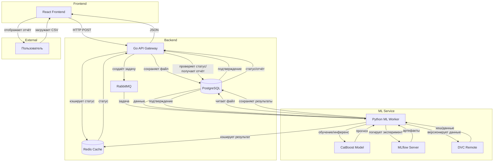

# Лабораторная работа №2  
## «Корректировка архитектуры системы на основе стратегии валидации, воспроизводимости, масштабируемости»

---

## 1. Стратегия валидации и обеспечение воспроизводимости

### 1.1. Стратегия валидации модели

Задача относится к прогнозированию временных рядов на уровне «товар‑день». Стандартная случайная кросс‑валидация (например, `KFold`) здесь неприменима, так как она нарушает временную структуру и приводит к **look‑ahead bias** (использованию информации из будущего при обучении). Предлагается следующая стратегия валидации:

- **Метод:** **TimeSeriesSplit с последовательным расширением окна обучения** (расширяющееся окно).  
  - Первая итерация: обучение на периоде 2016–2020, валидация на 2021.  
  - Вторая итерация: обучение на 2016–2021, валидация на 2022.  
  - И так далее до последнего года (2025).  
  - Количество фолдов: 5 (по числу полных лет после 2020).

- **Дополнительный отложенный тест:** последние 3 месяца данных (октябрь–декабрь 2025) откладываются **один раз** для финальной оценки модели после выбора гиперпараметров. Эти данные не используются ни на одном этапе валидации и настройки.

- **Метрики валидации:**  
  - Основная: **MAE** (средняя абсолютная ошибка спроса) — интерпретируема в единицах товара.  
  - Контрольная: **RMSE** — для отслеживания крупных отклонений.  
  - Бизнес‑метрика: **прирост валовой прибыли** на валидационном периоде относительно исторической ценовой политики (оценивается после работы оптимизатора цен).

- **Предотвращение переобучения на тесте:**  
  - Тестовый период используется строго однократно.  
  - Все решения о выборе модели и гиперпараметров принимаются только по результатам валидации на фолдах TimeSeriesSplit.  
  - Фиксация случайного seed (42) для воспроизводимости разбиений.

### 1.2. Обеспечение воспроизводимости экспериментов

Для полной воспроизводимости результатов необходимо версионировать следующие компоненты:

| Компонент | Инструмент | Что сохраняется |
|-----------|------------|-----------------|
| **Данные** | DVC (Data Version Control) | Сырой датасет `ContosoSales.parquet`, промежуточные файлы после предобработки, фичи. DVC отслеживает хеши файлов и позволяет откатиться к любой версии данных. |
| **Код** | Git | Весь исходный код: пайплайн обработки, генерация признаков, обучение модели, оптимизатор. |
| **Модель** | MLflow | Артефакты модели (файл `.cbm` для CatBoost), гиперпараметры, метрики валидации, теги (версия данных, коммит Git). |
| **Окружение** | Conda / Poetry / Docker | Файлы `environment.yml`, `pyproject.toml` или `Dockerfile` с фиксированными версиями библиотек (pandas, catboost, numpy). |
| **Случайность** | Фиксация `random_state=42` | Все генераторы псевдослучайных чисел (разбиение данных, инициализация модели) инициализируются одним seed. |

**Дополнительно для длительного обучения (несколько часов/дней):**  
- Логирование промежуточных метрик в MLflow каждые N итераций бустинга.  
- Сохранение чекпоинтов модели (CatBoost поддерживает `save_snapshot`).  
- Использование облачного хранилища для артефактов (например, S3‑совместимого MinIO) для доступа с разных машин.

---

## 2. Анализ потенциальных утечек данных

Для задачи динамического ценообразования на исторических транзакциях выявлены следующие риски утечки данных:

| № | Источник утечки | Описание риска | Способ предотвращения |
|---|-----------------|----------------|------------------------|
| 1 | **Использование будущих агрегатов при построении признаков** | При вычислении скользящих средних или лагов для дня *t* случайно захватываются данные дней *t+1*, *t+2*. | Применение **временных окон со смещением**: например, `rolling(7).mean().shift(1)`, чтобы средняя за 7 дней вычислялась только по дням **до** текущего. Все трансформации выполняются внутри временного цикла с эмуляцией реального времени. |
| 2 | **Глобальная нормализация с учётом тестового периода** | Использование среднего и стандартного отклонения по всему датасету (включая тестовую часть) для нормализации признаков. | Расчёт статистик нормализации **только на обучающей выборке** для каждого фолда TimeSeriesSplit. На тестовой выборке применяются те же параметры (сохранённые из обучения). |
| 3 | **Утечка через идентификаторы товаров (ProductKey) при группировке** | Если для товара, присутствующего только в тестовом периоде, модель обучалась с его уникальным `ProductKey`, то она может «запомнить» спрос этого товара, хотя в обучении его не было. | CatBoost использует **Ordered Target Statistics** и по умолчанию применяет **online‑кодирование** категориальных признаков с учётом временной метки. Дополнительно: задание параметра `has_time=True` в пуле данных CatBoost для предотвращения использования будущих значений целевой переменной при вычислении статистик. |
| 4 | **Утечка через общие тренды, вычисленные на всём датасете** | Например, извлечение глобального годового тренда методом декомпозиции временного ряда до разделения на train/test. | Декомпозиция ряда (если требуется) выполняется только на обучающей части с последующей экстраполяцией тренда на тест, либо используются исключительно **локальные лаговые признаки**, не зависящие от глобального будущего. |

**Обоснование маловероятности других утечек:**  
- Данные не содержат персональной информации клиентов, утечка через `CustomerKey` в контексте прогнозирования спроса на товар не критична, так как модель работает на уровне товара, а не клиента.  
- Целевая переменная (`Quantity`) строится на исторических данных без вмешательства человека, поэтому отсутствует риск «человеческого фактора» (ручной разметки будущих событий).

---

## 3. Оценка нагрузки и стратегия масштабирования

### 3.1. Ожидаемая нагрузка

Сервис предназначен для периодического пересчёта оптимальных цен бизнес‑пользователями (менеджерами, аналитиками). Это не real‑time сервис с тысячами запросов в секунду, а **batch‑ориентированная система** по запросу.

| Параметр | Значение | Обоснование |
|----------|----------|-------------|
| **RPS (requests per second)** | < 1 в среднем, пик до 5 | Пользователи загружают CSV‑отчёты нечасто — несколько раз в день для крупных категорий. |
| **Пиковый трафик** | До 10 параллельных загрузок в час | Возможен при одновременной работе нескольких аналитиков (например, в конце месяца). |
| **Допустимое время ответа (latency)** | 5–15 минут для отчёта | Пользователь ожидает, что обработка займёт некоторое время (загружается большой файл, выполняется оптимизация по всем товарам). Интерактивный отклик не требуется. |

### 3.2. Стратегия масштабирования

При росте количества пользователей или размера данных система может масштабироваться следующими способами:

1. **Горизонтальное масштабирование ML‑воркеров**  
   - Очередь RabbitMQ позволяет добавлять произвольное количество Python‑воркеров. Каждый воркер забирает одну задачу из очереди.  
   - При увеличении числа параллельных запросов достаточно запустить дополнительные контейнеры с воркером (например, через `docker-compose up --scale worker=5`).  
   - Это **асинхронная архитектура** — пользователь получает `task_id` и периодически опрашивает статус. Время выполнения одной задачи остаётся прежним, но пропускная способность системы растёт линейно.

2. **Кеширование результатов для повторяющихся запросов**  
   - Если пользователь загружает тот же самый файл (или файл с идентичным хешем), сервис может вернуть готовый результат из PostgreSQL без повторного запуска оптимизации.  
   - Кеш может храниться в Redis с TTL = 1 час для снижения нагрузки на БД.

3. **Оптимизация инференса**  
   - При росте объёма данных (например, миллионы товаро‑дней) можно применить **batch‑инференс** внутри воркера: прогноз для всех товаров и всех ценовых точек выполняется одной операцией `model.predict(batch)`, что значительно быстрее построчных вызовов.  
   - Использование GPU‑версии CatBoost при необходимости (хотя для текущих объёмов CPU достаточно).

4. **Партиционирование данных в PostgreSQL**  
   - Таблицы с историей запросов и результатами можно секционировать по дате создания, чтобы ускорить выборку статуса задачи при большом количестве записей.

**Синхронный vs Асинхронный инференс:**  
Для данной задачи **асинхронный инференс** является единственно правильным выбором, так как время обработки превышает разумный порог для HTTP‑запроса (более 30 секунд). Архитектура с очередью сообщений и периодическим опросом статуса гарантирует устойчивость и масштабируемость.

---

## 4. Корректировка архитектуры системы и стека

На основе решений по валидации, воспроизводимости и масштабированию вносятся следующие изменения в архитектурную документацию (шаги 5–7 ЛР1).

### 4.1. Добавленные компоненты

- **MLflow Tracking Server** – централизованное хранение метрик, параметров и артефактов моделей.  
- **DVC Remote Storage** (например, локальная директория или S3‑совместимое хранилище) – для версионирования наборов данных.  
- **Redis** – для кеширования статусов задач и готовых результатов.

### 4.2. Обновлённая контекстная диаграмма

