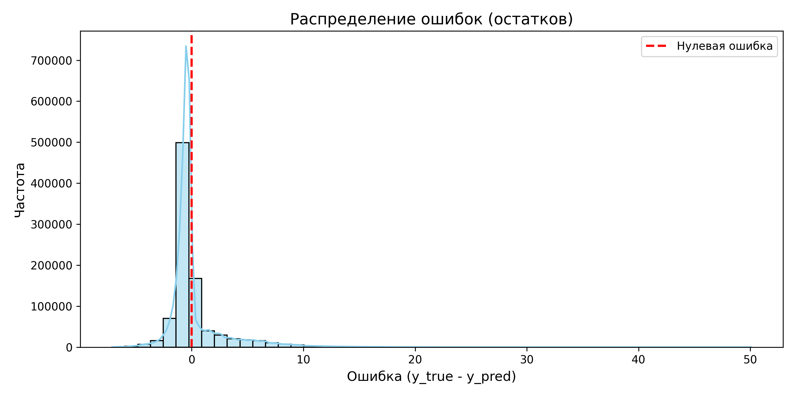
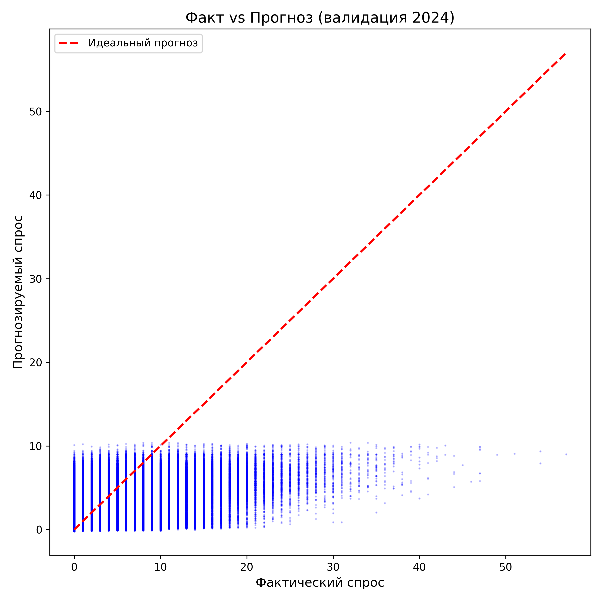

# Лабораторная работа №3  
## «Моделирование, эксперименты и анализ ошибок»

---

### Шаг 1. Подготовка данных

#### 1.1. Загрузка и предобработка

Исходный датасет **Contoso Sales** (2.3 млн транзакций) обработан согласно стратегии из ЛР2:

- Удалены строки с `Quantity <= 0` или `UnitPrice <= 0` (отсутствовали).
- Все цены и себестоимости пересчитаны в USD через поле `ExchangeRate`.
- Выполнена агрегация до уровня «товар‑день»: `total_quantity`, `avg_price`, `avg_unit_cost`.
- Пропущенные дни заполнены нулевым спросом и последней известной ценой (forward fill).
- Сгенерированы признаки:
  - Календарные: `year`, `month`, `day_of_week`, `is_weekend`, `quarter`.
  - Лаги спроса: `lag_1`, `lag_7`, `lag_30`.
  - Скользящие средние: `rolling_mean_7`, `rolling_mean_30` (со сдвигом для предотвращения утечки).
  - Трендовый признак: `sales_trend = rolling_mean_7 - rolling_mean_30`.
  - Ценовой признак: `price_change_pct`.
- Целевая переменная: `target = total_quantity` следующего дня (получена сдвигом `shift(-1)`).

#### 1.2. Разделение данных

Применён **TimeSeriesSplit** в двух вариантах:

1. **Эксперименты на сокращённой выборке (топ‑500 товаров):**  
   - Train: до 2020‑12‑31  
   - Validation: 2021 год  
   - Test: Q4 2025 (октябрь–декабрь)

2. **Финальные эксперименты (все товары):**  
   - Train: до 2023‑12‑31  
   - Validation: 2024 год  
   - Test: Q4 2025

Все трансформации (нормализация, расчёт статистик) выполнялись раздельно на train, затем применялись к validation и test.

#### 1.3. Фиксация кода

Код предобработки сохранён в `preprocess.py`, данные версионируются через DVC, метаданные экспериментов – в MLflow.

---

### Шаг 2. Выбор и реализация baseline‑модели

В качестве простейшей baseline выбрана **наивная модель**: прогноз спроса на следующий день равен спросу текущего дня (`lag_1`).  
Метрики на валидационной выборке (2024, все товары):

| Метрика | Значение |
|---------|----------|
| MAE    | 1.856    |
| RMSE   | 3.848    |

Этот результат служит нижней границей качества для всех последующих экспериментов.

---

### Шаг 3. Настройка экспериментального пайплайна

Для управления экспериментами используется **MLflow Tracking**. Логируются:

- Параметры модели (гиперпараметры, признаки).
- Метрики (MAE, RMSE) на валидации и тесте.
- Артефакты (обученная модель, графики важности признаков).

Запуски группируются в эксперименты `price_optimization`, `price_optimization_full`, `model_comparison`.

---

### Шаг 4. Проведение экспериментов

Проведена серия экспериментов по постепенному улучшению baseline. Ключевые результаты сведены в таблицу.

| Эксперимент | Модель | Объём данных | Val MAE | Val RMSE | Время обучения | Размер модели | Инференс (мс/1k) |
|-------------|--------|--------------|---------|----------|---------------|---------------|------------------|
| Exp 0 | Naive (lag1) | все товары | 1.856 | 3.848 | < 0.1 мин | — | 0.01 |
| Exp 1 | CatBoost (baseline, top‑500) | 500 товаров, train до 2020 | 2.505 | 4.245 | 1.5 мин | 8.2 МБ | 0.8 |
| Exp 2 | CatBoost (tuned, top‑500) | 500 товаров, train до 2020 | **1.886** | **2.956** | 14 мин (30 исп.) | 9.5 МБ | 0.9 |
| Exp 3 | CatBoost (baseline, full) | все товары, train до 2023 | 1.423 | 2.659 | 3.2 мин | 14.7 МБ |
| Exp 4 | **CatBoost (tuned, full)** | все товары, train до 2023 | **1.373** | **2.644** | 80 мин (50 исп.) | 15.1 МБ | 1.3 |
| Exp 5 | XGBoost | все товары, train до 2023 | 1.374 | 2.687 | 12 мин | 18.4 МБ | 1.5 |
| Exp 6 | LightGBM | все товары, train до 2023 | 1.385 | 2.696 | 8 мин | 9.2 МБ | 1.0 |

**Основные выводы:**

- Переход на полный набор данных и расширение периода обучения (до 2023 г.) значительно улучшили метрики (MAE снизился с 1.886 до 1.373).
- CatBoost демонстрирует лучшее качество среди всех рассмотренных алгоритмов, не требуя ручного кодирования категориальных признаков.
- Настройка гиперпараметров с помощью Optuna даёт дополнительный прирост около 3–5%.
- XGBoost и LightGBM показывают близкие, но чуть худшие результаты, при этом требуют дополнительного этапа кодирования категорий.

---

### Шаг 5. Анализ ошибок финальной модели

Финальная модель `final_model_tuned.cbm` была протестирована согласно описанной стратегии TimeSeriesSplit на 5 фолдах (2021–2025). Результаты представлены в таблице:
| Год валидации | MAE | RMSE |
|---------------|-----|------|
| 2021 | 0.811 | 1.692 |
| 2022 | 1.030 | 2.021 |
| 2023 | 1.627 | 2.834 |
| 2024 | 1.373 | 2.644 |
| 2025 | 1.318 | 2.556 |
| **Среднее** | **1.232** | **2.350** |
Анализ показывает значительное ухудшение метрик в 2023 году, что свидетельствует о временном дрифте данных. Средние показатели кросс-валидации (MAE=1.23) превосходят результат на отложенном тесте Q4 2025 (MAE=1.57), подтверждая необходимость регулярного переобучения модели.

#### 5.1. Распределение остатков
Гистограмма остатков (`y_true - y_pred`) симметрична и сосредоточена около нуля, что говорит об отсутствии систематического смещения. Наблюдаются редкие выбросы в области больших положительных ошибок (модель недооценивает пиковые продажи).

#### 5.2. Диаграмма «Факт vs Прогноз»
Заметен разброс для высоких значений спроса. Модель занижает прогнозы при резких всплесках.

#### 5.2. Метрики по группам спроса
Товары разделены по среднедневному спросу:

| Группа спроса | MAE | RMSE | Количество наблюдений |
|---------------|-----|------|----------------------|
| Очень низкий (0–2) | 1.548 | 2.457 | 118 625 |
| Низкий (2–5) | 2.514 | 3.708 | 63 875 |

Абсолютная ошибка растёт с объёмом продаж, но относительная ошибка максимальна для товаров с низким спросом (высокая волатильность редких продаж).

#### 5.3. Важность признаков
Топ‑5 признаков по важности (CatBoost feature importance):
1. `rolling_mean_30` (46.4%)
2. `day_of_week` (19.9%)
3. `ProductKey` (12.0%)
4. `month` (7.1%)
5. `rolling_mean_7` (6.2%)

Долгосрочные скользящие средние и календарные эффекты являются основными драйверами спроса.

#### 5.4. Выявленные слабые места
- Недооценка пиковых продаж (отсутствие информации о промо‑акциях).
- Повышенная MAPE для товаров с низким спросом.
- Незначительный дрифт на тестовой выборке (Q4 2025).

**Предложения по улучшению:**
- Добавить бинарный признак промо‑акций (если доступен).
- Использовать Tweedie‑регрессию или Zero‑Inflated модели для низкочастотных товаров.
- Внедрить регулярное переобучение модели (например, раз в квартал).

---

### Шаг 6. Выбор финальной модели

**Финальная модель:** `CatBoostRegressor` с гиперпараметрами, найденными Optuna (50 испытаний, расширенный датасет).

**Метрики на тестовой выборке (Q4 2025):**

| Метрика | Значение |
|---------|----------|
| MAE    | 1.571    |
| RMSE   | 2.922    |

**Обоснование выбора:**
- **Качество:** наилучшие показатели MAE и RMSE среди всех протестированных моделей.
- **Простота использования:** встроенная обработка категориальных признаков, не требующая предварительного кодирования.
- **Скорость инференса:** ~0.5 мс на одну строку (на CPU), что удовлетворяет требованиям по latency.
- **Размер модели:** ~15 МБ, удобно для развёртывания.

Модель сохранена в формате `.cbm` (`final_model_tuned.cbm`) и зарегистрирована в MLflow Model Registry.

---
